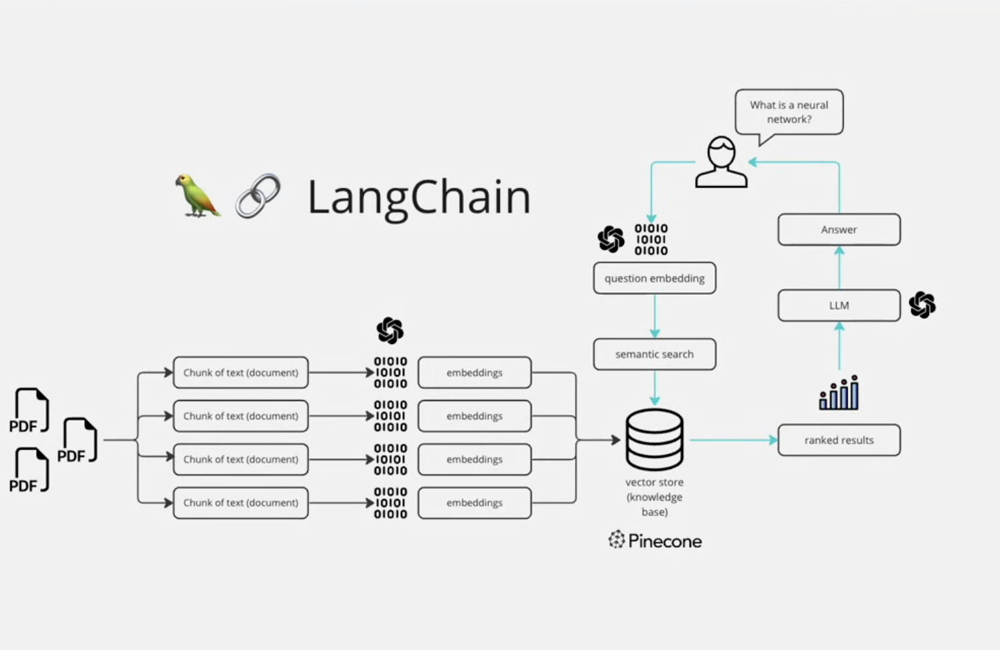

# 📄 PDF Agent with LangChain

This project is a **Streamlit-based PDF Agent** that processes messy PDF documents (e.g., delivery tickets) using OCR, text extraction, and LangChain for conversational retrieval. It extracts structured data, handles OCR errors, and lets users ask questions about the documents interactively.

---

## 🧠 Overview

The PDF Agent leverages **LangChain**, **Tesseract OCR**, and a **vector store (FAISS)** to:

- Extract relevant information from messy PDFs.
- Handle low-resolution scans and inconsistent formatting.
- Enable interactive Q&A on PDF contents.

---

## 📸

Here’s what the app looks like in action:




---

## 🚀 Features

- **OCR Support**: Uses `pytesseract` to extract text from low-quality scans.
- **Text Cleaning**: Automatically fixes common OCR errors (e.g., "PROOUCTS" → "PRODUCTS").
- **Structured Data Extraction**: Uses regex to pull delivery ticket numbers, item names, and more.
- **Conversational Retrieval**: Lets users ask natural questions using LangChain’s `ConversationalRetrievalChain`.
- **Streamlit UI**: Clean interface for uploading PDFs and asking questions.

---

## 🧰 Prerequisites

Make sure you have:

- Python 3.11+
- OpenAI API key (for embeddings & LLM)

---

## ⚙️ Installation

### 1. Clone the Repo

```bash
git clone <repository-url>
cd PDF-Agent
